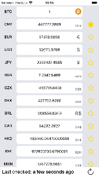

# BTCurr
BTCurr is a mobile app created with [Expo](https://github.com/expo/expo) that displays the current Bitcoin price in multiple currencies.
## Getting Started
1. Clone the repository
2. Run `npm install`
3. Add a `.env*.local` file to the root of the project with the following content:
```
EXPO_PUBLIC_GETGEO_KEY=YOUR_API_KEY
```
4. Run `npm start` to start the development server or `npm run ios` or `npm run android` to start the app on a simulator or device.
### Generate ios and android folders
 * iOS: Run `npx expo run:ios --configuration Release`
 * Android: Run `npx expo run:android --variant release`

## Demo
##### iOS
